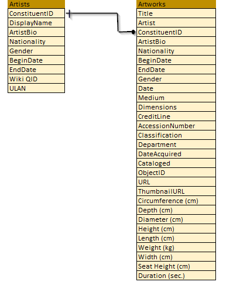

# PDS Proyecto final

Este repositorio contiene los archivos e instrucciones para crear un pipline con la base de datos [The Museum of Modern Art(MoMA)](https://github.com/MuseumofModernArt/collection) como parte del proyecto final para la materia Programming for data science. 

**Integrantes de equipo**

- Eddie Jr. Lozada Jeronimo 175938, 
- Francisco Paz Cendejas 175764,
- Marissa Martínez García 175901.

### MOMA

**Descripción de la base de datos**

El Museum of Modern Art (MoMA) pone a dispocisión una exhaustiva base de datos online que contiene información de instalaciones fotográficas, archivos de instalación y catálogos de exposiciones desde su fundación en 1929, dicha información se encuentra disponible para estudiantes, investigadores y público en general.
Existen dos conjuntos de datos disponibles, el conjunto denominado **Artists** contiene 15,091 registros, que representan a todos los artistas que han trabajado en la colección del MoMA, el segundo conjunto denominado **Artworks** contiene 130,262 registros, que representan todas las obras a las que se ha accedido en la colección del MoMA.

**Tabla Artists.**

Esta tabla contiene 9 variables. La descripción de cada una de ella se encuentra en la siguiente tabla:


|Variable      | Descripción                         | 
|--------------|-------------------------------------|
|ConstituentID | Identificador del artista           |
|DisplayName   | Nombre                              |
|ArtistBio     | Resumen de la biografía del artista |
|Nationality   | Nacionalidad                        |
|Gender        | Genero                              |
|BeginDate     | Año de nacimiento                   |
|EndDate       | Año de fallecimiento                |
|Wiki QID      | Wikidata QID                        |
|ULAN          | Union List of Artist Names ® (ULAN) |

**Tabla Artworks.**

Esta tabla contien 29 variables, con la siguiente descripción:

|Variable        |Descripción                                  |
|----------------|---------------------------------------------|
|Title           | Titulo de la obra                           |
|Artist          | Nombre del artista                          |
|ConstituentID   | Identificador del artista                   |
|ArtistBio       | Resumen de la biografía del artista         |
|Nationality     | Nacionalidad                                |
|Gender          | Genero                                      |
|BeginDate       | Año de nacimiento                           |
|EndDate         | Año de fallecimiento                        |
|Date            | Año de creación de la obra                  |
|Medium          | Material de la obra                         |
|Dimensions      | Dimensiones de la obra                      |
|CreditLine      | Linea de crédito de la obra                 |
|AccessionNumber | Número asignado a la adquisición            |
|Classification  | Tipo de obra                                |
|Department      | Departamento de arte                        |
|DateAcquired    | Año de adquisición de la obra               |
|Cataloged       | Catalogo de la obra                         |
|ObjectID        | Identificador de la obra                    |
|URL             | URL de la obra en pagina web de MoMA        |
|ThumbnailURL    | Thumbnail de la obra en pagina web de MoMA  |
|Circumferenc    | Circunferencia en cm                        |
|Depth (cm)      | Profundidad de la obra en cm                |
|Diameter (cm)   | Diametro en cm                              |
|Height (cm)     | Altura en cm                                |
|Length (cm)     | Longitud en cm                              |
|Weight (kg)     | Peso en kg                                  |
|Width (cm)      | Anchura en cm                               |
|Seat Height(cm) | Altura del asiento en cm                    |
|Duration (sec.) | Duración en segundos                        |


### Diagrama Entidad-Relación

Con las 2 tablas antes mencionadas, creamos el diagrama de entidad-relación. Notese que vamos de uno (en la tabla Artists ) a muchos (en la tabla Artwrks).



### Proyecto

Es necesario tomar en cuenta los siguientes puntos, para poder correr el proyecto:
	
* Para asegurarnos del correcto funcionamiento de los comandos, es necesario contar con la maquina virtual [Vagrant](https://github.com/ITAM-DS/programming-for-data-science-2019). En el link puedes encontrar más información.
* Tener este repositorio clonado de forma local en tu computadora.
* Seguir las instrucciones para crear el ambiente virtual y ocupar los archivos de python.


Una vez conectado a tu maquina virtual debes clonar este repositorio, para ello debes utilizar el siguiente comando

```
git clone https://github.com/Mari29ku/PDS_Proyecto_final
```

Posicionarte en la carpeta donde se encuentra el repositorio y cambiarte a la carpeta `bin`. 

```
cd bin
```

En la carpeta `bin` se encuentra el archivo  `descarga_moma.sh` con este, se realiza la descarga de los datos. Para poder correrlo es necesario seguir las siguientes instrucciones:

1. Asignar permisos al archivo
```
 chmod +x descarga_moma.sh
```

2. Ejecutar
```
./descarga_moma.sh
```

Los datos descargados se encuentrar en la carpeta `data`. Ahora, procederemos con la creación del ambiente virtual. Cambiate a la carpeta `MOMA` con 

```
cd ../MOMA
```

Los siguientes comandos crean el ambiente virtual, se lo asignan a la carpeta `MOMA` e instala las dependencias necesarias. Corre estos comandos para obtener lo antes descrito.

```
pyenv virtualenv 3.7.3 MOMA 
echo MOMA>.python-version 
pip install poetry 
poetry install
```

Ahora que tenemos todas las cofiguraciones necesarias y los datos, procedemos con la creación de la base de datos, para ello, usaremos PostgreSQL. Ejecuta los siguientes comandos. 


1. Conectar a postgres
```
sudo su postgres
```
2. Ejecutar
```
psql
```
3. Finalmente corremos las siguientes lineas para crear la base de datos, el rol y asignar los permisos necesarios.
```
CREATE DATABASE moma WITH ENCODING='UTF8' LC_CTYPE='en_US.UTF-8' LC_COLLATE='en_US.UTF-8' OWNER=postgres TEMPLATE=template0 CONNECTION LIMIT=-1;
create role moma login ;
alter role moma with encrypted password 'moma_final';
grant all privileges on database moma to moma;
```
4. Regresar al shell original (ejecutar 2 veces)
```
ctrl + d
```

En este punto ya tenemos los datos, el ambiente virtual y la base de datos SQL. Ahora estamos listos para realizar las transformaciones.

Ubicados en la carpeta `MOMA` vamos a correr el script ` moma.py`. Si ejecutas 

```
python moma.py
```
Se despliegan los comandos que se pueden seelecionar:

* create-schemas
* create-raw-tables
* load-moma
* to-cleaned
* to-semantic

Corre las opciones en el orden mencionado antes, es decir:

```
python moma.py create-schemas
```


```
python moma.py create-raw-tables
```


```
python moma.py load-moma
```

```
python moma.py to-cleaned
```

```
python moma.py to-semantic
```


### Referencias

1. La base de datos [MoMA](https://github.com/MuseumofModernArt/collection) [](https://doi.org/10.5281/zenodo.3558822)

2. Notas de la materia [Programming for Data Science 2019](https://github.com/ITAM-DS/programming-for-data-science-2019/blob/master/handbook.pdf)